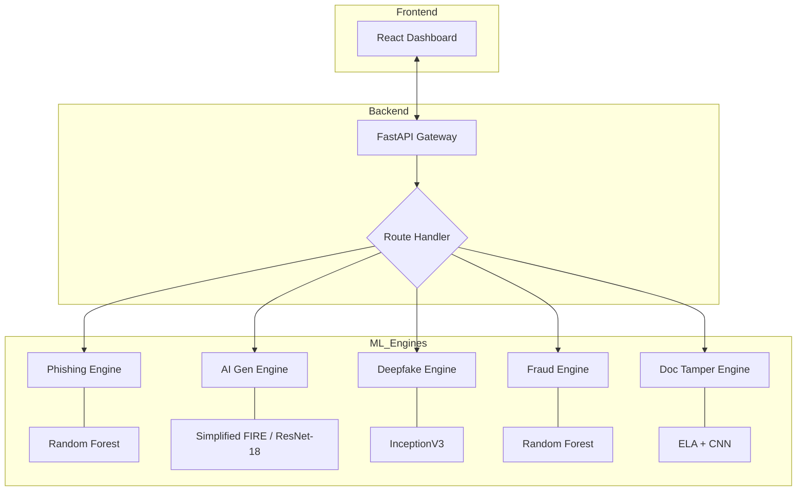

# Cybershield AI Security Platform - Technical ML Documentation

## 1. Executive Summary
Cybershield is a state-of-the-art AI security suite that leverages diverse Machine Learning architectures—from classical Random Forests to custom Deep Convolutional Neural Networks (CNNs)—to protect users against evolving digital threats.

---

## 2. Global System Architecture

---

## 3. Module Deep Dives

### 3.1 Phishing Website Detection (RF-96)
*   **Objective**: Real-time URL and HTML content classification.
*   **Core Model**: Random Forest Classifier with 100 estimators.
*   **Performance Comparison**:
    *   Random Forest: **96.69%**
    *   Decision Tree: 95.31%
    *   SVM: 94.32%
    *   KNN: 93.03%
*   **Feature Engineering (16 Dimensions)**:
    *   **Structural**: `URL_Length`, `URL_Depth`, `Have_IP`, `Have_At`, `TinyURL`, `Prefix/Suffix` (presence of '-').
    *   **Network**: `DNS_Record` validation, `Web_Traffic`, `Domain_Age`.
    *   **Behavioral (HTML)**: `iFrame` detection, `Mouse_Over` scripts, `Right_Click` disabling, `Web_Forwards`.
*   **Tech Stack**: `scikit-learn`, `pandas`, `requests`, `socket`.

### 3.2 AI-Generated Asset Detection (S-FIRE)
*   **Objective**: Identifying synthetic images from Stable Diffusion, Midjourney, and GANs.
*   **Model Architecture**: **Simplified FIRE** (Frequency-Inherited ResNet Extension).
    *   **Backbone**: ResNet-18.
    *   **Frequency Filter**: Uses Fast Fourier Transform (FFT) to extract mid-frequency components where AI models often leave subtle repetitive artifacts.
    *   **Fusion**: Concatenates raw RGB (3 ch) with Frequency-Filtered maps (3 ch) to form a 6-channel input.
*   **Metrics**: 
    *   **Validation Accuracy**: 92.50%
    *   **Precision**: 93.63% | **Recall**: 91.20%
*   **Tech Stack**: `PyTorch`, `Torchvision`, `Numpy`.

### 3.3 Deepfake Video/Image Detection (IV3-DF)
*   **Objective**: Detect face-swaps and GAN-based facial manipulations.
*   **Model**: **InceptionV3** (Inception-v3) using Transfer Learning.
*   **Implementation Details**:
    *   Global Average Pooling for dimensionality reduction.
    *   Dropout layer (0.5) to prevent overfitting.
    *   Final Dense layer with Sigmoid activation for binary classification.
*   **Metrics**: 
    *   **Updated Validation Accuracy**: **88.77%**
*   **Preprocessing**: Normalized frame intensities, batch-normalization during training.
*   **Tech Stack**: `TensorFlow`, `Keras`, `OpenCV`.

### 3.4 Credit Card Fraud Detection (CCF-RF)
*   **Objective**: High-precision anomaly detection in transaction streams.
*   **Core Model**: Random Forest with class-weight balancing.
*   **Handling Class Imbalance**: 
    *   Utilizes a high number of decision trees to provide robust voting against rare fraud cases.
    *   Evaluation focuses on ROC-AUC rather than raw accuracy due to the 99.9% legitimate transaction ratio.
*   **Metrics**:
    *   **Accuracy**: 97.86%
    *   **ROC-AUC**: 0.9680
*   **Data Features (PCA)**: V1-V28 (Anonymized features), Amount, and Time.
*   **Tech Stack**: `scikit-learn`, `joblib`.

### 3.5 Fake Document Detection (ELA-CNN)
*   **Objective**: Detection of "copy-paste" or "clone stamp" tampering in official documents (IDs, Salary slips).
*   **Methodology**: **Error Level Analysis (ELA)**.
    *   ELA resaves an image at a specific compression level (90%) and calculates the absolute difference between the original and the resaved version.
    *   Tampered regions appear as bright "noise" because they diverge in compression error compared to original pixel blocks.
*   **Classifier**: 4-layer Convolutional Neural Network (CNN).
*   **Metrics**: 
    *   **Validation Accuracy**: ~77%+ (Initial Baseline).
*   **Tech Stack**: `Keras`, `Pillow`, `TensorFlow`.

---

## 4. Unified Inference Pipeline
The `unified_app.py` serves as the central API hub. It implements:
1.  **Asynchronous Handling**: Uses FastAPI's `async def` for non-blocking IO.
2.  **Schema Validation**: Pydantic models for URL inputs and JSON responses.
3.  **Cross-Library Support**: Simultaneously runs `torch` (AI-Gen) and `tensorflow` (Deepfake/Doc) backends in a single process.
