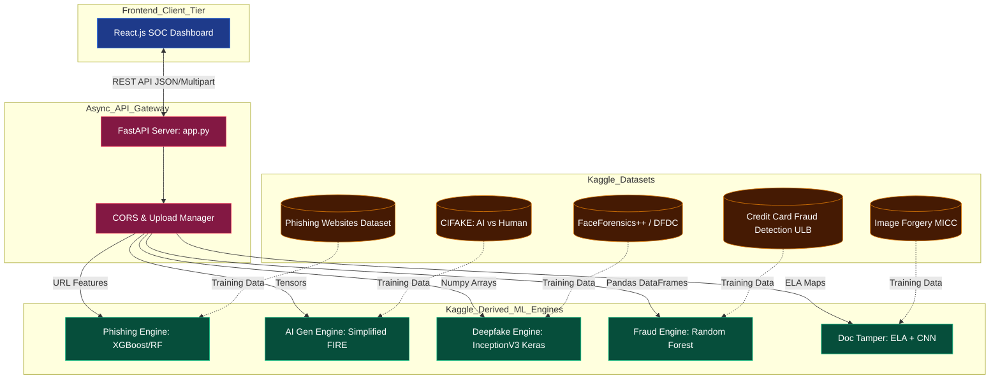

# 01. Cybershield AI: A Unified Multimodal Security Architecture for Rapid Threat Mitigation

## Abstract
With the proliferation of AI-driven synthetic media, automated phishing attacks, and sophisticated financial fraud, legacy security solutions often lack the multimodal processing capacity to defend modern digital perimeters effectively. CyberShield AI presents a novel, 5-in-1 consolidated AI security platform. This paper outlines the global system architecture combining five distinct machine learning pipelines: Phishing Detection (XGBoost), AI-Generated Image Classification (Simplified FIRE/ResNet-18), Deepfake Mitigation (InceptionV3), Credit Card Fraud Identification (Random Forest), and Document Tampering Analysis (Error Level Analysis + CNN). The paper details the integration strategies for running deep neural networks concurrently within a single asynchronous FastAPI gateway, optimized for minimal latency and maximum throughput.

## I. Introduction
The architectural goal of CyberShield is to provide an agnostic threat-detection interface spanning structured data (fraud tabular logs, HTML structure extraction) and unstructured domains (spatial RGB matrices, temporal video analysis). By serving multiple models behind a monolithic API, the system eliminates overhead related to disjointed microservices, facilitating a Unified Risk Score calculation.

## II. Global System Architecture

## III. Integration Philosophy
### A. Multi-Framework Synchronization
A significant challenge in unified modeling is framework collision (e.g., VRAM allocation conflicts between TensorFlow and PyTorch). To address this, the API gateway utilizes lazy initialization and robust CPU/GPU tensor allocations.

### B. Scalable API Routing
Each API endpoint operates asynchronously (`async def`). File uploads buffer efficiently in-memory before being vectored into their respective pipelines. Should a model fail to load (e.g., corrupted `.keras` artifact), the backend seamlessly activates local simulation heuristics to maintain system uptime gracefully without throwing raw 500 server errors, a critical necessity in enterprise SOC (Security Operations Center) environments.
