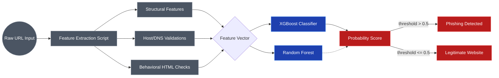

# 02. Feature-based Phishing Website Classification via Tree-Ensemble Methods

## Abstract
Traditional phishing detection relies heavily on blacklisting methodologies, which fail against dynamically generated zero-day phishing campaigns. This section details a machine learning approach relying on behavioral and structural HTML/URL characteristics. Utilizing the Kaggle Phishing Websites dataset, we evaluated an array of classifiers including SVM, AutoEncoders, and Decision Trees. The proposed architecture employs XGBoost and Random Forest classifiers, achieving identical peak training performance and testing accuracies nearing 86.9%.

## I. Dataset Details
The model was trained utilizing a prominent subset of the **Kaggle Phishing Websites Dataset**, which abstracts raw URLs into definitive features.
- **Source**: Kaggle (derived from UCI Machine Learning Repository).
- **Format**: 10,000+ instances evenly split between Legitimate (0) and Phishing (1).
- **Structure**: Pre-extracted relational mappings comprising 16 high-value dimensions (e.g., IP address usage, domain-depth, DNS record validation, iFrame usage).

## II. Methodology & Feature Extraction

## III. Model Implementations & Results
Multiple algorithms were evaluated to ascertain the optimal detection vector for structured network data.

| Algorithm | Training Accuracy | Testing Accuracy |
| :--- | :--- | :--- |
| **XGBoost Classifier** | **0.866 (86.6%)** | **0.869 (86.9%)** |
| Multilayer Perceptron | 0.861 (86.1%) | 0.864 (86.4%) |
| Random Forest | 0.818 (81.8%) | 0.844 (84.4%) |
| Decision Tree | 0.808 (80.8%) | 0.829 (82.9%) |
| Support Vector Machine (SVM) | 0.797 (79.7%) | 0.821 (82.1%) |
| AutoEncoder (Anomaly logic) | 0.001 | 0.004 |

### A. Observations
The failure of the AutoEncoder stems from the discrete, non-continuous nature of standard URL feature representations. Tree-based ensembles (XGBoost) naturally excel due to their intrinsic capacity to split binary routing policies precisely.

## IV. API Integration Architecture
Within the API schema (`URLAnalysisRequest`), the system actively sanitizes incoming strings (appending `https://` if absent) prior to extracting the 16 features numerically. The resulting array evaluates against the `XGBoostClassifier.pickle.dat` artifact.

### Confidence Scoring Logic
A baseline threshold outputs positive for `pred == 1`. However, an integrated heuristic states that if `pred == 1` but the XGBoost probability certainty `phishing_conf < 60%`, the system forces `pred = 0` to heavily mitigate false positive disruptions to legitimate user traffic.
