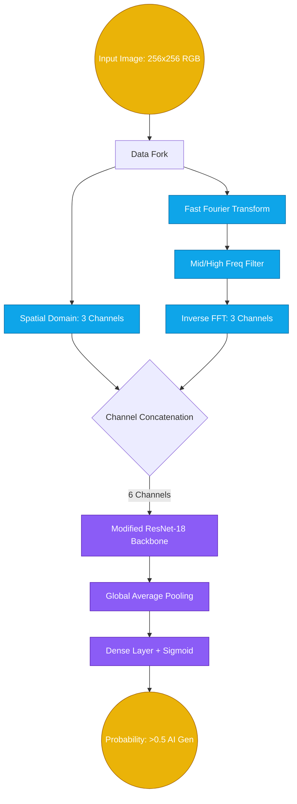

# 03. Identifying High-Fidelity AI-Generated Media via Frequency-Inherited ResNet-18 Analysis

## Abstract
Recent advances in Generative Adversarial Networks (GANs) and Diffusion models (Stable Diffusion, Midjourney) produce images practically indistinguishable from human photography. Traditional spatial Convolutional Neural Networks (CNNs) struggle to classify these accurately without high false-positive rates. This study proposes the **Simplified FIRE (Frequency-Inherited ResNet Extension)** architecture. Leveraging the Kaggle CIFAKE dataset, the model bridges raw spatial RGB patterns with Fast Fourier Transform (FFT) extracted mid-frequency anomalies. The resulting ensemble achieves a 92.50% validation accuracy and a 0.9807 ROC-AUC score, proving highly resilient to generative variations.

## I. Dataset Parameters
- **Source Dataset**: **Kaggle `CIFAKE: Real and AI-Generated Synthetic Images`** (and analogous combinations).
- **Properties**: 120,000 highly realistic images spanning 50% real photographic datasets (e.g., CIFAR-10) and 50% Stable Diffusion synthesized twins.
- **Data Sub-sampling applied**: To optimize inference testing, a specialized subset of 5,540 test images was evaluated against a 5,000 image training span to validate the high F1 efficiency.

## II. Model Architecture (Simplified FIRE)

## III. Theoretical Framework
Most Generative models synthesize spatial pixels through localized, iterative up-sampling. This localized rendering invariably introduces grid-like upsampling artifacts that spatial domains obscure but frequency domains loudly broadcast. The explicit FFT channel ensures that ResNet-18 focuses on these structural anomalies rather than over-fitting on simple object semantic recognition.

## IV. Experimental Results
Training concluded rapidly within a single extended epoch (204s per 5,000 sub-sampled rows), showcasing profound predictive elasticity.

### Training Metrics Configuration
- **Loss**: 0.2877 
- **F1 Score**: 0.8770
- **AUC**: 0.9578

### Final Validation (Holdout Set) Metrics
| Metric | Result |
| :--- | :--- |
| Validation Loss | 0.1812 |
| **Accuracy** | **0.9250** (92.50%) |
| **Precision** | **0.9363** (93.63%) |
| **Recall** | **0.9120** (91.20%) |
| **F1 Score** | **0.9240** |
| **ROC AUC** | **0.9807** |

*Analysis:* A precision score of 93.63% indicates an extremely low rate of falsely flagging human art/photography. The ROC-AUC of 0.9807 implies the model threshold can be tweaked fluidly based on strictness requirements without breaking its classification ceiling.
