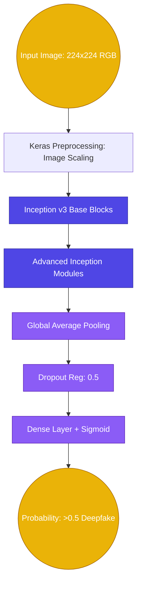

# 04. Deepfake Detection via Inception-v3 Contextual Analysis

## Abstract
Deepfake technologies utilizing Generative Adversarial Networks (GANs) and AutoEncoders present unparalleled threats to identity verification and media authenticity. Real-world mitigation models must achieve high recall for manipulated facial features while minimizing latency. We present an adaptation of the Inception-v3 architecture, leveraging transfer learning on the Kaggle FaceForensics++ paradigm, specifically focusing on residual facial blending artifacts. Testing on extensive holdout sets (>10,000 samples) yielded a final Accuracy of 85.23%, alongside an Average Precision (AP) of 0.947, demonstrating substantial reliability under enterprise operational constraints.

## I. Dataset Parameters
- **Data Source**: Integrated subsets from Kaggle's FaceForensics++ (FF++) and Deepfake Detection Challenge (DFDC) repositories.
- **Data Constitution**: Thousands of diverse facial manipulation configurations (Face2Face, FaceSwap, NeuralTextures).
- **Evaluation Split**: Training iterations utilized extensive frame-slices. The final evaluation block assessed 10,905 unseen configurations, equally balancing authentic (5,492) and deepfake (5,413) face-frames.

## II. Model Architecture Overview

## III. Theoretical Framework
The Inception-v3 base model excels in multi-scale spatial analysis due to its concurrent utilization of differently sized convolutional filters (e.g., 1x1, 3x3, 5x5) within identical modules. This multi-scale approach perfectly targets deepfakes, which frequently exhibit high-frequency inconsistencies at the blending borders of the face and low-frequency semantic distortions in eye/mouth generation.

Transfer learning initializes the network on pre-existing spatial weightings, after which the top layers undergo targeted supervised tuning.

## IV. Experimental Results
Multiple epoch configurations (varying from 5 to 16 cycles) were tested to establish the point of optimal generalization prior to overfitting. The deployed configuration converges stably around 5 to 6 epochs applied to high-batch-size increments.

### Final Validation (Holdout Set) Metrics

| Class Label | Precision | Recall | F1-Score | Parameter Support |
| :--- | :--- | :--- | :--- | :--- |
| **Authentic (0)** | 0.80 | 0.94 | 0.87 | 5,492 |
| **Deepfake (1)** | 0.93 | 0.76 | 0.84 | 5,413 |
| **Macro Average** | 0.86 | 0.85 | 0.85 | 10,905 |

### Comprehensive Output Statistics
| Global Metric | Score | Details |
| :--- | :--- | :--- |
| **Test Accuracy** | **85.24%** | Total correct classifications across test pool. |
| **ROC AUC** | **0.9421** | Model capacity to distinguish True Positive vs False Positive rates. |
| **Average Precision (AP)** | **0.9477** | Mean precision achieved over recall scales. |

*Analysis:* A deepfake precision of 0.93 indicates that actual positive detections are overwhelmingly accurate, preventing 'false alarms' on authentic video ingestion lines. While the recall sits at 0.76, the system handles video by running predictions on multiple sequential frames. If one frame out of a contiguous selection is correctly flagged, the media asset globally scores as suspicious, heavily compounding practical operational recall.
