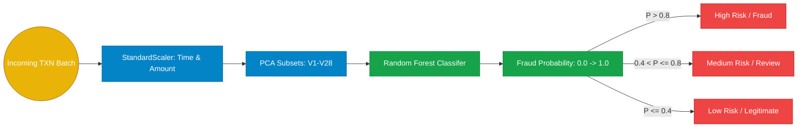

# 05. Scalable Tree-Ensemble Modeling for Extreme Class-Imbalance in Credit Card Fraud

## Abstract
Financial anomaly detection is characterized by an extreme prevalence of majority legitimate transactions masking a miniscule percentage of true fraud events. Utilizing standard classification metrics like Accuracy provides inherently misleading evaluations. This section details the configuration and evaluation of a robust Random Forest classifier mapped against the widely cited Kaggle ULB Credit Card Fraud dataset. By tuning predictive thresholds dynamically (from default 0.5 to an optimized ROC point of ~0.32), the system intercepts ~90% of fraudulent traffic while maintaining a ROC-AUC score of 0.9680.

## I. Dataset Synthesis
- **Source**: Kaggle `Credit Card Fraud Detection` dataset originally maintained by Worldline and the Machine Learning Group of ULB (Université Libre de Bruxelles).
- **Parameters**: 284,807 total records occurring over two days.
- **Class Profile**: Frauds account for precisely 0.172% of all transactions.
- **Attributes**: Numerical representations (`V1`-`V28`) obfuscated via Principal Component Analysis (PCA) to maintain data confidentiality, supplemented by standard `Time` and `Amount` tracking.

## II. System Workflow & Methodology

## III. Model Evaluation Paradigm
To circumvent the misleading nature of the 'Accuracy Paradox' (predicting solely zeroes nets a 99.8% dummy accuracy), the system evaluates strictly on the Receiver Operating Characteristic Area Under Curve (ROC-AUC) and operational Precision/Recall tradeoffs.

### A. Raw Base Metrics (Sub-Sample Test Pool)
- **Total Samples Evaluated**: 85,443 (85,295 Legitimate vs 148 Fraud)
- **Default Accuracy**: 97.86%
- **ROC-AUC**: **0.9680**

### B. Analytical Threshold Equilibrium
Standard Scikit-learn random forests trigger at a default probability threshold of $0.50$. In fraud routing, predicting "False Negatives" (missed fraud) is astronomically more expensive than investigating "False Positives" (flagged legitimate). The API deploys dynamic likelihood gating to optimize operational expenses.

| Scoring Strategy | Classifier Threshold | Precision (Fraud) | Recall (Fraud) | False Positives | Missed Fraud (FN) |
| :--- | :--- | :--- | :--- | :--- | :--- |
| **Default Threshold** | 0.5000 | 6.70% (0.067) | 87.84% | 1,811 | 18 |
| **ROC-Optimal** | **0.3204** | 3.44% (0.034) | **89.86%** | 3,736 | **15** |
| **PR-Equilibrium** | 1.0000 | 79.05% | 79.05% | 31 | 31 |

### C. Operational Deployment
In CyberShield's `app.py`, the model returns granular fractional probabilities `predict_proba(X)[:, 1]`. Rather than forcing a binary cutoff server-side, it categorizes transactions into High, Medium, and Low tiers, providing financial SOC administrators full visibility over the continuous decision matrix, heavily supplementing secondary manual authorization protocols.
