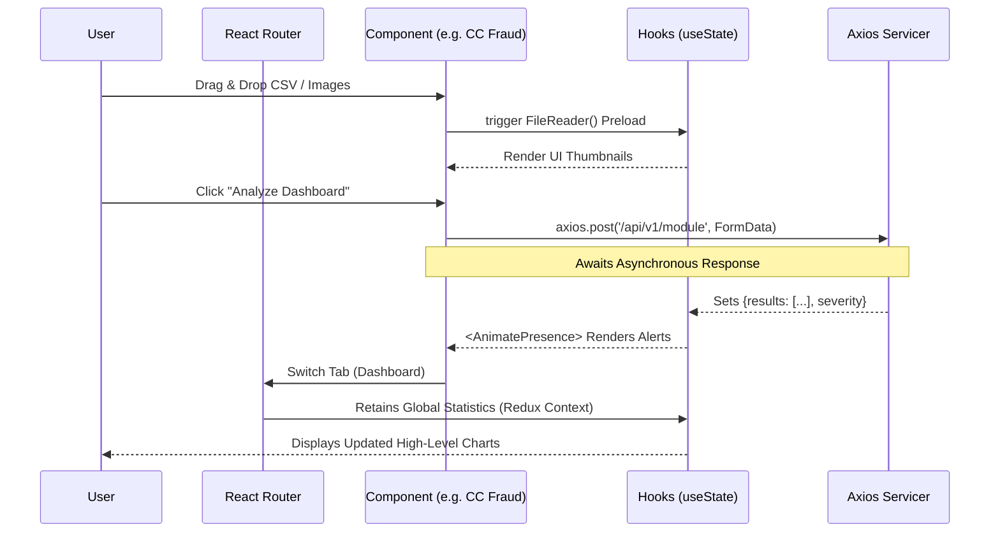

# 07. Visualizing Multi-vector Telemetry via Asynchronous Frontend UI Subsystems

## Abstract
Modern Security Operations Centers (SOCs) require the real-time aggregation of continuous threat intelligence. The CyberShield frontend subsystem consolidates the output of multiple disparate Machine Learning micro-engines into a unified, high-performance Graphical User Interface (GUI). Built upon the React.js library, this module emphasizes stateless rendering, asynchronous state-mutation, and hardware-accelerated user animations. The architecture ensures non-blocking data ingestion capable of visually parallelizing large CSV transaction loads and extensive image forensics batches simultaneously.

## I. Core Framework & Configuration
- **Library Base**: React.js configured via Vite for ultra-low latency Hot Module Replacement (HMR).
- **Styling Architecture**: TailwindCSS. Utilizes a comprehensive `index.css` global override file that defines `cyber-primary`, `cyber-text`, and complex pseudo-selector neon animations mimicking advanced Glassmorphic SOC interfaces.
- **Motion Dynamics**: The `framer-motion` framework orchestrates heavy DOM mounting and unmounting through mathematically bound spring physics, preventing jarring layouts when threat matrices update.

## II. Interaction Architecture Workflow

## III. Component Specializations
Each specialized security tool maintains isolated component life-cycles to prevent massive re-rendering cascades:

### A. Temporal Media Analysis (Deepfakes / AI-Gen)
Components utilize native HTML5 File API streams. An `input type="file" multiple` intercepts the drag event. Blobs are read natively into base64 visual strings for immediate Local DOM rendering without prior backend validation, providing zero-latency user feedback. 

### B. High-Volume Tabular Rendering (Credit Card Fraud)
Fraud detection logs regularly span hundreds of rows. The UI encapsulates `<table>` subsets wrapped into paginated arrays, maintaining 60 FPS scrolling rates. Conditional Tailwind string-interpolations colorize rows dynamically based on the `$P > 0.8` vulnerability threshold returned by the FastAPI gateway.

### C. Unified State Dashboard 
At the root level, `Dashboard.jsx` leverages `Recharts` SVG-binding arrays. It repeatedly polls the `/api/v1/stats` endpoint, synthesizing total system metrics ("Global Threats Blocked", "Queries Analyzed") into real-time interactive bar and pie distributions.
