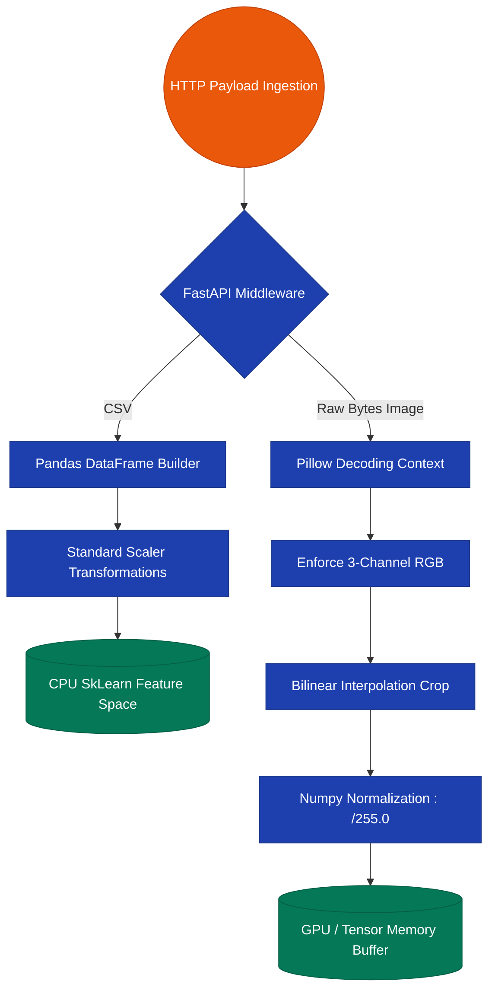

# 09. Life-cycle Analysis of Multi-Dimensional Data Telemetry

## Abstract
Enterprise-grade Machine Learning inference requires rigorous mapping of payload shapes—from the original client state HTTP request into the terminal Boolean flag parsed by numerical optimization networks. This section maps the full sequential flow of data operations within the CyberShield AI framework, tracing byte origins through serialization, framework execution, and response synthesis mappings.

## I. Global Ingestion Phase (The Client Boundary)
Regardless of the target module, user interactions trigger serialized HTTP queries targeting localized (`http://127.0.0.1:8000`) bindings masked securely under an environmental `VITE_API_URL`.
- Images & Documents execute binary buffering via `FormData.append(key, blob)`.
- Text & URL metrics pass locally through lightweight JSON string stringification via `application/json`.

## II. Tensor Transformation Pipeline

## III. Multi-Threaded Inferencing Output
1. **Mathematical Scoring**: The model processes the target memory block, yielding probability values representing target activations. The values output continuously (e.g., $0.0 < P_{fraud} < 1.0$). 
2. **Boolean Gating**: Logic hooks dynamically interpret continuous numbers into binary triggers. If probabilities exceed $0.5$ (or specific defined variables, such as $0.37$ for Document anomalies), the respective `is_deepfake`, `is_tampered` trigger switches to `True`.
3. **Synthesis Response Construction**: 
   A JSON object merges the raw confidence floats with user-friendly strings (e.g., `fraud_tier: "High"`), additionally concatenating analytical execution speeds `time.time() - start_time` directly for performance analysis metrics.

## IV. Shared State Updating (Persistence Layer)
Post-inference, before returning the JSON vector to the client, the API globally intercepts the result array. Utilizing python's `json.dump` modules synchronously, it appends scanning frequencies + threat counts to `stats.json`. This singular file guarantees that whenever the React SOC Dashboard mounts newly, all isolated engine checks summarize unified macro metrics globally accurately.
