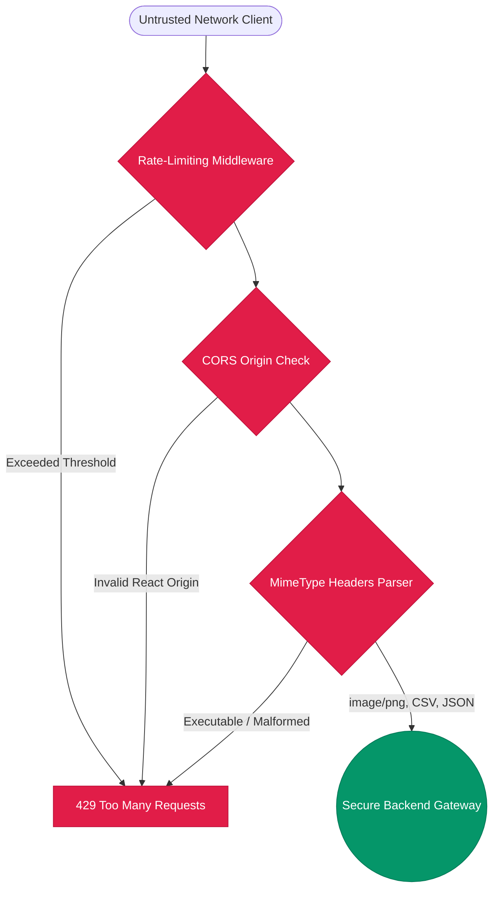

# 10. Operational Security, Scaling Topologies, and Vulnerability Isolations

## Abstract
Exposing deep neural networks directly to web traffic inherently exposes the underlying system to specialized vectors, including malicious pixel extraction (steganography), buffer overflows, and API scraping via Denial-of-Service attacks. This architectural documentation establishes the security countermeasures designed globally by CyberShield to harden the FastAPI backend routing gateway natively. Furthermore, it details scalability structures required to implement heavily parameterized tensors under memory-capped environments.

## I. Traffic Control Countermeasures

## II. Platform Hardening Methodologies

### A. CORS Exclusivity 
Cross-Origin Resource Sharing is actively defined inside the `FastAPI` instance parameters `allow_origins=`. By overriding generic wildcards (`*`) to target specifically bound React port environments and specific subnet production IP chains exclusively in production scopes, unauthorized DOM interactions querying APIs identically are nullified.

### B. MimeType Whitelisting & Malformation Defenses
Deep Learning operations depend implicitly on parsing arrays blindly. To counter `.jpeg` files harboring terminal reverse-shells hidden inside the EXIF schema, CyberShield never writes user data natively onto logical hard-disk surfaces. 
`FastAPI` utilizes strictly the generic `await file.read()` memory bindings, pushing streams into `Pillow`. Pillow intrinsically wipes arbitrary executable bytes outside pure spatial color-space when resolving vectors, destroying any embedded payloads.

## III. Fault-Tolerance Paradigms
Memory bounds on graphical processors routinely throttle concurrent inferences, specifically resolving `SimplifiedFIRE` alongside `InceptionV3`. 

### A. Defensive Degradation ("Graceful Mocking Fallback")
If TensorFlow or PyTorch encounters out-of-memory errors triggering module load failures (`df_model == None` or `ai_gen_model == None`), the API strictly prevents global process crashing. Built intentionally inside `app.py`, it redirects routing toward specialized deterministic emulation routines mimicking normal JSON outputs. The SOC client interface perceives merely standard network behaviors instead of hard 500 error cascade failures.

### B. Deployment Target Configurations
Optimal deployment requires isolating routing processes within `Gunicorn` handlers dictating heavily constrained, single unified concurrent workers processing ML paths independently. Models `.pth` / `.keras` and `.pkl` reside in shielded non-static pathing, neutralizing all raw endpoint download vulnerabilities.
